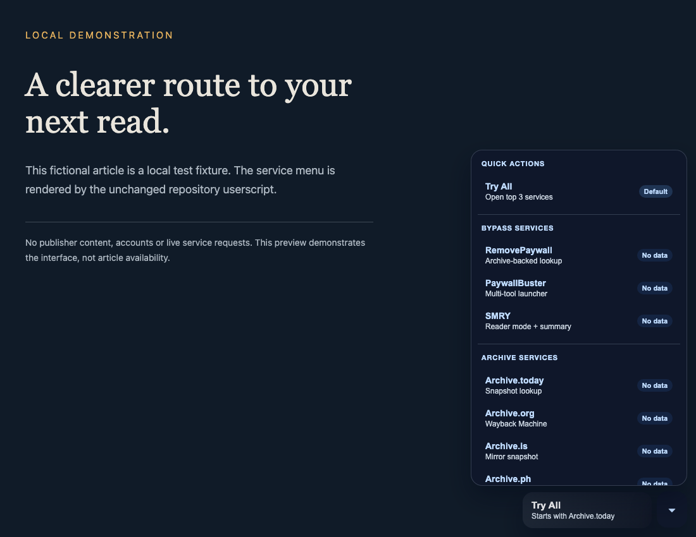

<div align="center">


# Paywall Bypass Script

**One menu for archive lookups, reading services, and your next option.**

[](https://greasyfork.org/en/scripts/495817-paywall-bypass-script-12ft-io-google-cache-paywallbuster-com) [](paywall-bypass.user.js) [](#supported-sites) [](LICENSE)

[Install](#quick-install) · [Preview](#interface-preview) · [Features](#features) · [Usage](#usage) · [Troubleshooting](#troubleshooting) · [Development](#repository-guide)

</div>

A desktop-and-mobile **userscript** that adds a floating button, grouped service menu, keyboard shortcuts, and targeted client-side site fixes to supported article pages. It runs local site packs where available, opens archive and reading services, prioritizes a route for selected sites, and keeps your service feedback locally.

**This is a service launcher.** A matching domain or a paywall-detection signal does not guarantee that an article is available. External services determine their own coverage and availability.

## Quick Install

1. Install a compatible [userscript manager](#installation) for your browser.
2. Open the [Greasy Fork install page](https://greasyfork.org/en/scripts/495817-paywall-bypass-script-12ft-io-google-cache-paywallbuster-com) and confirm installation in your manager.
3. Visit a [supported article page](#supported-sites). Use **Try All** or open the chevron menu to choose one service.

- Primary install: [Greasy Fork stable release](https://greasyfork.org/en/scripts/495817-paywall-bypass-script-12ft-io-google-cache-paywallbuster-com)
- Source install: [Raw GitHub userscript](https://raw.githubusercontent.com/tyhallcsu/paywall-bypass-script/main/paywall-bypass.user.js)
- Mobile install: Use [AdGuard](https://adguard.com/) userscript support on iOS or Android with the same raw GitHub URL. Availability depends on the AdGuard product, platform, and browser integration.

The checked-in userscript declares version **2.1.0**. Its `@downloadURL` and `@updateURL` point to GitHub `main`; see the [manual publishing workflow](.github/workflows/greasyfork-sync.md) for keeping GitHub and Greasy Fork aligned.

## Interface Preview



*Real userscript UI, captured on a local fictional article with userscript APIs shimmed. The menu, Try All button, groups, and “No data” badges are rendered by the unchanged source. No publisher content or live service requests are included.* [Capture details](assets/README.md#interface-capture).

## Overview

The primary public install page is [Greasy Fork](https://greasyfork.org/en/scripts/495817-paywall-bypass-script-12ft-io-google-cache-paywallbuster-com). This repository holds development source, documentation, release notes, and maintainer workflow.

| Component | Status in this repository |
|---|---|
| [Userscript](paywall-bypass.user.js) | Implemented: floating controls, detection, client-side site fixes, service routing, local feedback and settings |
| [Chrome extension](chrome-extension/) | Scaffold only; not a working extension or store release |
| [Firefox add-on](firefox-addon/) | Scaffold only; not a working add-on |
| [paywall-detect package](packages/paywall-detect/) | Private placeholder; no production implementation |
| [Service registry](services.json) | Proposed registry; the userscript currently uses its embedded service catalog |

Extension ports, adaptive routing, and the community registry remain [roadmap work](ROADMAP.md). Roadmap milestone numbers do not establish that a feature shipped in userscript version 2.1.0.

## Features

- Paywall auto-detection that scans the page and briefly pulses the floating button when a likely paywall is present
- Client-side site rule packs for Medium-family pages, Bloomberg, Los Angeles Times, MIT Technology Review, Globe and Mail, and selected Australian Community Media sites
- Default **Try All** action that opens the top 3 services in one click
- Site-aware routing that prioritizes Archive.today for WSJ / NYTimes, RemovePaywall for Washington Post, and SMRY for Reuters
- Grouped service menu with local reliability badges based on your own success/failure feedback
- Floating button visibility toggle stored locally with `GM_getValue` / `GM_setValue`
- Keyboard shortcuts: `Alt+Shift+B` for the default bypass and `Alt+Shift+M` for the service menu
- Dark-mode-aware UI that respects `prefers-color-scheme` and common host-site dark themes
- Export / import settings as JSON through the userscript manager menu
- No telemetry and no external API calls beyond opening the selected bypass services

## Usage

### Quick Start

1. Open a supported article page.
2. If a supported site pack is available, the script tries local fixes automatically after the page renders.
3. Click **Try All** or press `Alt+Shift+B` to open the top services in new tabs.
4. Click the chevron button or press `Alt+Shift+M` to choose a specific service or run **Apply Local Fixes** again.
5. When you come back to the article tab, mark which service worked so the script can update your local reliability badges.

### Paywall Detection

- The script checks for common paywall markers such as `paywall`, `subscribe`, `premium`, `metered`, `piano`, `tinypass`, and `poool`
- If a likely paywall is detected, the floating button pulses and shows a brief **Paywall Detected** badge

### Client-Side Site Fixes

- Local rule packs run automatically on supported domains before you need an external service
- The first-wave packs target Medium-family pages, Bloomberg, Los Angeles Times, MIT Technology Review, Globe and Mail, and selected Australian Community Media publications
- If a page loads late or changes after in-page navigation, use **Apply Local Fixes** from the dropdown or userscript menu to rerun the pack
- When a structured `articleBody` is still present in page metadata, the script can append a clean local recovery block without sending data anywhere

### Local Reliability Tracking

- The script stores up to 100 local success/failure results
- Reliability percentages shown in the dropdown come from your own saved results
- All tracking is local-only and never transmitted anywhere

### Settings

- Use the userscript manager menu to hide or show the floating button
- Use **Export Settings** to copy your config and local stats as JSON
- Use **Import Settings** to restore the same setup on another browser or device
- Advanced users can reorder the default service priority in the `DEFAULT_SERVICE_ORDER` array near the top of [paywall-bypass.user.js](paywall-bypass.user.js)

## Services

The menu groups eight destinations by purpose. Service selection opens another tab; it does not retrieve and replace article text inside the current page.

| Group | Destinations | Purpose |
|---|---|---|
| Bypass services | RemovePaywall · PaywallBuster · SMRY | Archive-backed lookup, multi-tool launcher, reader/summary route |
| Archive services | Archive.today · Archive.is · Archive.ph · Archive.org / Wayback Machine | Snapshot lookup and archive alternatives |
| Analysis tools | SimilarWeb | Domain analysis; not an article bypass |

**Try All** opens up to three prioritized services. Site-specific preferences include Archive.today for WSJ / NYTimes, RemovePaywall for Washington Post, and SMRY for Reuters. These are configured preferences, not live health checks.

The runtime catalog is in [paywall-bypass.user.js](paywall-bypass.user.js). The service audits in [FEATURES.md](FEATURES.md) are dated **2026-03-14** and should not be read as current availability guarantees.

## Supported Sites

The script currently ships with `232` `@match` patterns across major news, finance, technology, and regional publishers. That includes Bloomberg, WSJ, NYTimes, Washington Post, The Atlantic, Financial Times, Reuters, Fortune, Wired, Medium, BBC, CNN, Politico, Ars Technica, TechCrunch, and many more.

A match pattern controls where the script can run; it is not proof that a service can retrieve every article. The checked-in [metadata block](paywall-bypass.user.js) is authoritative for this checkout. For the published release, consult:
[Greasy Fork listing](https://greasyfork.org/en/scripts/495817-paywall-bypass-script-12ft-io-google-cache-paywallbuster-com)

## Installation

### Choose a userscript manager

- [Tampermonkey](https://www.tampermonkey.net/) for Chrome, Firefox, Safari, and Edge
- [Greasemonkey](https://www.greasespot.net/) for Firefox
- [Violentmonkey](https://violentmonkey.github.io/) for Chrome and Firefox
- [AdGuard](https://adguard.com/) for mobile userscript support

Manager availability varies by platform and browser version; check the linked provider for current installation support.

### Install options

- Live release: [Install from Greasy Fork](https://greasyfork.org/en/scripts/495817-paywall-bypass-script-12ft-io-google-cache-paywallbuster-com)
- Source mirror: [Install from GitHub raw](https://raw.githubusercontent.com/tyhallcsu/paywall-bypass-script/main/paywall-bypass.user.js)

## Browser Compatibility

- Requires a browser with a working installation of Tampermonkey, Violentmonkey, Greasemonkey, or a compatible userscript manager
- Historical Windows 7 guidance: the original README suggested Chrome 109 with an archived Violentmonkey build or Firefox ESR. These legacy combinations have not been revalidated; consult the browser and manager projects for current support.
- The script uses browser-native APIs and local userscript storage only
- The **Try All** feature works best when the browser allows pop-ups for supported news sites

## Troubleshooting

| What you see | What to check |
|---|---|
| No floating button | Confirm the script is enabled, the URL matches its metadata, and the manager’s visibility toggle is on. Reload the page. |
| Only one tab opens from Try All | Browser popup restrictions can block additional tabs. Use the menu to open a single destination. |
| “No data” beside a service | No local feedback exists yet; it is not a service-health result. |
| A service fails or has no snapshot | Try another menu entry. A supported domain does not guarantee archived content. |
| Detection misses a paywall or flags an ordinary page | Detection uses page heuristics. The service menu remains available without a positive detection result. |
| Shortcut does nothing | Try the on-page controls and check for browser or operating-system shortcut conflicts. |
| Extension folder will not load as a useful extension | Chrome and Firefox folders are development scaffolds. Install the userscript instead. |

For a reproducible problem, include the URL, browser, manager version, expected/actual behavior, and a screenshot in a [bug report](CONTRIBUTING.md#reporting-a-broken-site).

## Privacy

- No telemetry, analytics, or remote tracking
- No bundled third-party libraries or external runtime dependencies
- Preferences and reliability stats stay local in your userscript manager storage
- The only external requests the script triggers are the bypass or archive pages you explicitly open

When you open a service, that provider receives the article URL (or the domain for SimilarWeb) and normal browser request information. “No telemetry” describes this script, not the independent sites it opens. Settings export includes local configuration and reliability statistics.

## Repository Guide

| Path | What belongs here |
|---|---|
| [paywall-bypass.user.js](paywall-bypass.user.js) | Runnable userscript, metadata, embedded catalog and UI |
| [CHANGELOG.md](CHANGELOG.md) | Userscript release history |
| [CONTRIBUTING.md](CONTRIBUTING.md) | Reporting, local checks and contribution workflow |
| [ROADMAP.md](ROADMAP.md) · [FEATURES.md](FEATURES.md) | Future milestones and dated feature research |
| [docs/smart-engine-spec.md](docs/smart-engine-spec.md) | Proposed smart-routing design |
| [chrome-extension/](chrome-extension/) · [firefox-addon/](firefox-addon/) | Future browser-extension scaffolds |
| [packages/paywall-detect/](packages/paywall-detect/) | Future detection-library scaffold |
| [services.json](services.json) | Future registry shape; not loaded at runtime |
| [assets/](assets/README.md) | Banner, authentic demo capture and provenance |

There is no root npm install or build step. For a quick offline syntax check:

```sh
node --check paywall-bypass.user.js
```

This checks parsing only. Follow [local browser testing](CONTRIBUTING.md#testing-changes-locally) to verify behavior.

## Project Stats

<details>
<summary>Historical Greasy Fork snapshot · March 14, 2026</summary>

Stats below reflect the public Greasy Fork listing on `2026-03-14`.

| Metric | Value |
| --- | --- |
| Total installs | 6,660 |
| Daily installs | 19 |
| Ratings | 12 total (`11` good, `1` okay) |
| Supported domain patterns | 232 `@match` entries |
| First published | May 2024 |
| License | MIT |
| Maintenance status at snapshot | Active |

These are historical figures, not current counters. [Current public listing](https://greasyfork.org/en/scripts/495817-paywall-bypass-script-12ft-io-google-cache-paywallbuster-com).

</details>

## Project Links

- Greasy Fork page: [Paywall Bypass Script](https://greasyfork.org/en/scripts/495817-paywall-bypass-script-12ft-io-google-cache-paywallbuster-com)
- Raw install URL: [paywall-bypass.user.js](https://raw.githubusercontent.com/tyhallcsu/paywall-bypass-script/main/paywall-bypass.user.js)
- GitHub issues: [tyhallcsu/paywall-bypass-script/issues](https://github.com/tyhallcsu/paywall-bypass-script/issues)

## Changelog

Release history is documented in [CHANGELOG.md](CHANGELOG.md) and reconstructed from the public Greasy Fork version history:
[Greasy Fork version history](https://greasyfork.org/en/scripts/495817-paywall-bypass-script-12ft-io-google-cache-paywallbuster-com/versions)

## Contributing

Bug reports, site requests, and pull requests are welcome. Start with [CONTRIBUTING.md](CONTRIBUTING.md), and review the existing [Greasy Fork feedback page](https://greasyfork.org/en/scripts/495817-paywall-bypass-script-12ft-io-google-cache-paywallbuster-com/feedback) before opening a new report.

## License

Released under the [MIT License](LICENSE).

## Author

**sharmanhall**
- [Greasy Fork profile](https://greasyfork.org/en/users/866731-sharmanhall)
- [GitHub profile](https://github.com/tyhallcsu)

## Support

If this project is useful to you, [star the repository](https://github.com/tyhallcsu/paywall-bypass-script/stargazers) and consider sharing broken-site reports through [CONTRIBUTING.md](CONTRIBUTING.md) so the service list stays current.

## Roadmap

Future milestones, extension plans, and contributor-facing roadmap details are documented in [ROADMAP.md](ROADMAP.md).
