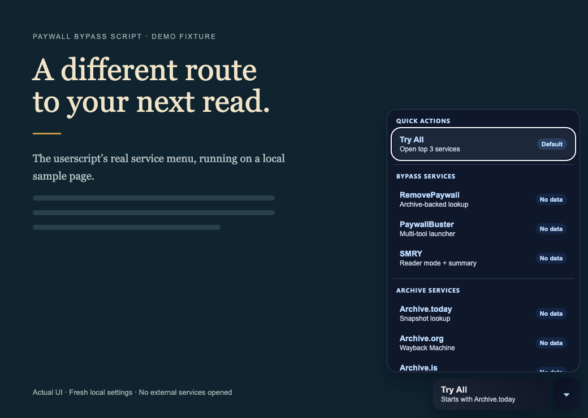

# Paywall Bypass Script

**Archive and bypass services, one article away.**

A privacy-first userscript with paywall detection, quick-try routing, and local-only reliability tracking.

   

**[Install](#quick-install)** · [See it in action](#preview) · [Usage](#usage) · [Services](#services) · [Contribute](#contributing)

---

## Overview

Paywall Bypass Script adds a floating **Try All** button, a grouped service menu, and keyboard shortcuts to supported article pages. Open up to three archive or bypass services at once, or choose one yourself. When you return, record what worked; your reliability badges come from your own local feedback.

[Greasy Fork](https://greasyfork.org/en/scripts/495817-paywall-bypass-script-12ft-io-google-cache-paywallbuster-com) is the primary public release. This repository holds the source, documentation, release notes, and maintainer workflow.

**Current distribution: userscript.** The Chrome extension, Firefox add-on, and detection package directories are planning scaffolds. Their next steps are documented in the [roadmap](ROADMAP.md).

## Quick Install

1. Install a [compatible userscript manager](#requirements) for your browser.
2. Open the **[Greasy Fork install page](https://greasyfork.org/en/scripts/495817-paywall-bypass-script-12ft-io-google-cache-paywallbuster-com)** and confirm installation in your manager.
3. Visit a [supported article page](#supported-sites), then click **Try All**.

| Install path | Use it for |
| --- | --- |
| **[Greasy Fork stable release](https://greasyfork.org/en/scripts/495817-paywall-bypass-script-12ft-io-google-cache-paywallbuster-com)** | The primary public install |
| [GitHub source userscript](https://raw.githubusercontent.com/tyhallcsu/paywall-bypass-script/main/paywall-bypass.user.js) | The version on this repository’s `main` branch |
| [AdGuard](https://adguard.com/) userscript support | Mobile installation on iOS or Android using the same raw GitHub URL |

The script opens external archive and bypass services. Results depend on the service and the article; a matching domain does not guarantee an available copy.

## Preview

Actual userscript UI on a synthetic demo page, using fresh local settings. No publisher content or external service result is shown. The banner above is original generated artwork.

## Features

- **Detect likely paywalls** — auto-detection that scans the page and briefly pulses the floating button when a likely paywall is present
- **Try several services** — the default **Try All** action that opens the top 3 services in one click
- **Start with a site-specific preference** — routing that prioritizes Archive.today for WSJ / NYTimes, RemovePaywall for Washington Post, and SMRY for Reuters
- **Choose a service** — grouped service menu with local reliability badges based on your own success/failure feedback
- **Control visibility** — floating button visibility toggle stored locally with `GM_getValue` / `GM_setValue`
- **Use the keyboard** — shortcuts: `Alt+Shift+B` for the default bypass and `Alt+Shift+M` for the service menu
- **Match your theme** — dark-mode-aware UI that respects `prefers-color-scheme` and common host-site dark themes
- **Move your setup** — export / import settings as JSON through the userscript manager menu
- **Keep feedback local** — no telemetry or background API calls; external services open only when you choose them

## Services

| Group | Included services |
| --- | --- |
| **Bypass** | RemovePaywall · PaywallBuster · SMRY |
| **Archive** | Archive.today · Archive.is · Archive.ph · Archive.org / Wayback Machine |
| **Analysis** | SimilarWeb (domain overview) |

**Try All** opens up to three prioritized services and excludes analysis tools. Site-specific rules prefer Archive.today for NYTimes, WSJ, Bloomberg, Financial Times, The New Yorker, and The Atlantic; RemovePaywall for Washington Post; and SMRY for Reuters. Other sites use the configured service order.

Service URLs and routing rules live in [paywall-bypass.user.js](paywall-bypass.user.js). The names above describe the bundled catalog, not a live availability check.

## Supported Sites

The GitHub userscript currently ships with `232` supported `@match` patterns across major news, finance, technology, and regional publishers. That includes Bloomberg, WSJ, NYTimes, Washington Post, The Atlantic, Financial Times, Reuters, Fortune, Wired, Medium, BBC, CNN, Politico, Ars Technica, TechCrunch, and many more.

Check the `@match` block in [the source userscript](paywall-bypass.user.js) for this checkout’s full list, or the canonical listing for the published release:
[Greasy Fork listing](https://greasyfork.org/en/scripts/495817-paywall-bypass-script-12ft-io-google-cache-paywallbuster-com)

## Installation

### Requirements

- [Tampermonkey](https://www.tampermonkey.net/) for Chrome, Firefox, Safari, and Edge
- [Greasemonkey](https://www.greasespot.net/) for Firefox
- [Violentmonkey](https://violentmonkey.github.io/) for Chrome and Firefox
- [AdGuard](https://adguard.com/) for mobile userscript support

### Install options

- Live release: [Install from Greasy Fork](https://greasyfork.org/en/scripts/495817-paywall-bypass-script-12ft-io-google-cache-paywallbuster-com)
- Source mirror: [Install from GitHub raw](https://raw.githubusercontent.com/tyhallcsu/paywall-bypass-script/main/paywall-bypass.user.js)

## Usage

### Quick Start

1. Open a supported article page.
2. Click **Try All** or press `Alt+Shift+B` to open the top services in new tabs.
3. Click the chevron button or press `Alt+Shift+M` to choose a specific service.
4. When you come back to the article tab, mark which service worked so the script can update your local reliability badges.

### Keyboard Shortcuts

| Shortcut | Action |
| --- | --- |
| `Alt+Shift+B` | Open the top services with **Try All** |
| `Alt+Shift+M` | Open or close the service menu |

### Paywall Detection

- The script checks for common paywall markers such as `paywall`, `subscribe`, `premium`, `metered`, `piano`, `tinypass`, and `poool`
- If a likely paywall is detected, the floating button pulses and shows a brief **Paywall Detected** badge

### Local Reliability Tracking

- The script stores up to 100 local success/failure results
- Reliability percentages shown in the dropdown come from your own saved results
- All tracking is local-only and never transmitted anywhere

### Settings

- Use the userscript manager menu to hide or show the floating button
- Use **Export Settings** to copy your config and local stats as JSON
- Use **Import Settings** to restore the same setup on another browser or device
- Advanced users can reorder the default service priority in the `DEFAULT_SERVICE_ORDER` array near the top of [paywall-bypass.user.js](paywall-bypass.user.js)

## Browser Compatibility

- Minimum: Any browser that supports Tampermonkey, Violentmonkey, Greasemonkey, or a compatible userscript manager
- Chrome 109 on Windows 7: try Violentmonkey from the Chrome Web Store archive, or use Firefox ESR on Windows 7 instead
- The script uses browser-native APIs and local userscript storage only
- The **Try All** feature works best when the browser allows pop-ups for supported news sites

## Privacy

- No telemetry, analytics, or remote tracking
- No bundled third-party libraries or external runtime dependencies
- Preferences and reliability stats stay local in your userscript manager storage
- The script opens third-party pages only when you select a service or **Try All**
- Selected services receive the article URL; SimilarWeb receives the domain. Their pages operate under their own privacy policies.

## Project Stats

Historical snapshot recorded in the project documentation on **March 14, 2026**. These figures are not live counters.

View the March 2026 snapshot

| Metric | Value |
| --- | --- |
| Total installs | 6,660 |
| Daily installs | 19 |
| Ratings | 12 total (`11` good, `1` okay) |
| Supported domain patterns | 232 `@match` entries |
| First published | May 2024 |
| License | MIT |
| Maintenance status at snapshot | Actively maintained |

## Project Links

- Greasy Fork page: [Paywall Bypass Script](https://greasyfork.org/en/scripts/495817-paywall-bypass-script-12ft-io-google-cache-paywallbuster-com)
- Raw install URL: [paywall-bypass.user.js](https://raw.githubusercontent.com/tyhallcsu/paywall-bypass-script/main/paywall-bypass.user.js)
- GitHub issues: [tyhallcsu/paywall-bypass-script/issues](https://github.com/tyhallcsu/paywall-bypass-script/issues)

## Changelog

Release history is documented in [CHANGELOG.md](CHANGELOG.md) and reconstructed from the public Greasy Fork version history:
[Greasy Fork version history](https://greasyfork.org/en/scripts/495817-paywall-bypass-script-12ft-io-google-cache-paywallbuster-com/versions)

## Contributing

Bug reports, site requests, and pull requests are welcome. Start with [CONTRIBUTING.md](CONTRIBUTING.md), and review the existing [Greasy Fork feedback page](https://greasyfork.org/en/scripts/495817-paywall-bypass-script-12ft-io-google-cache-paywallbuster-com/feedback) before opening a new report.

## Roadmap

Future milestones, extension plans, and contributor-facing roadmap details are documented in [ROADMAP.md](ROADMAP.md).

For the broader design direction, see the [feature strategy](FEATURES.md) and [smart-engine specification](docs/smart-engine-spec.md).

## License

Released under the [MIT License](LICENSE).

## Author

**sharmanhall**
- [Greasy Fork profile](https://greasyfork.org/en/users/866731-sharmanhall)
- [GitHub profile](https://github.com/tyhallcsu)

## Support

If this project is useful to you, [star the repository](https://github.com/tyhallcsu/paywall-bypass-script) and consider sharing broken-site reports through [CONTRIBUTING.md](CONTRIBUTING.md) so the service list stays current.
